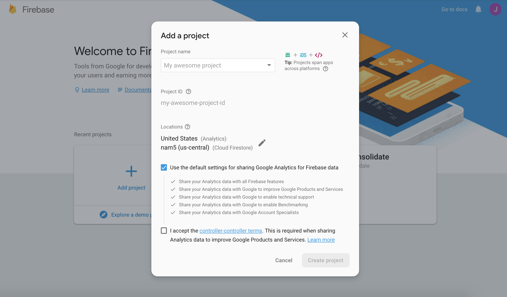
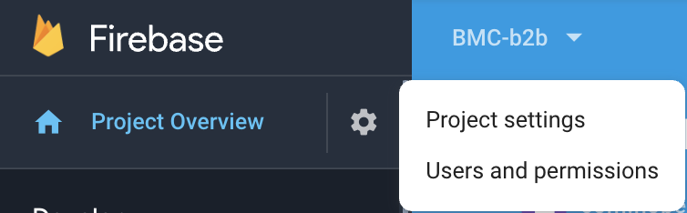
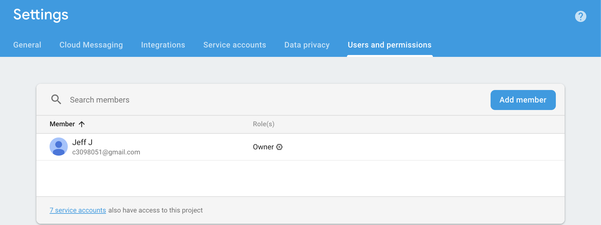
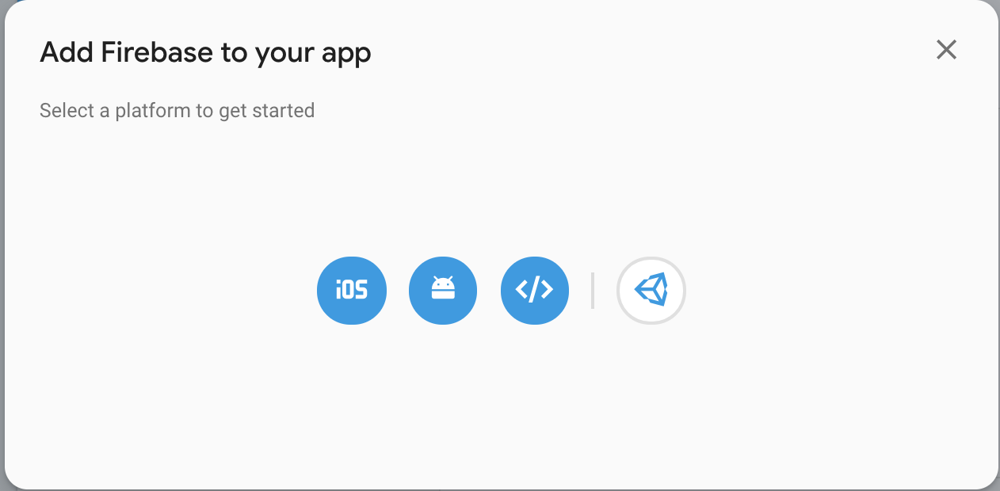
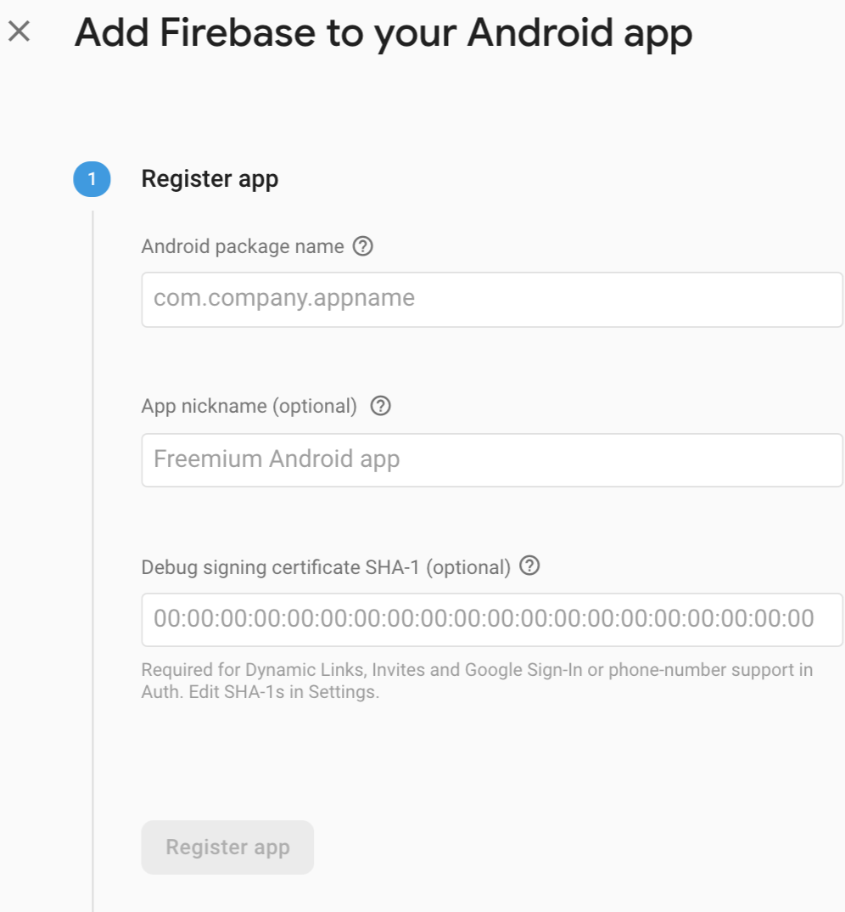
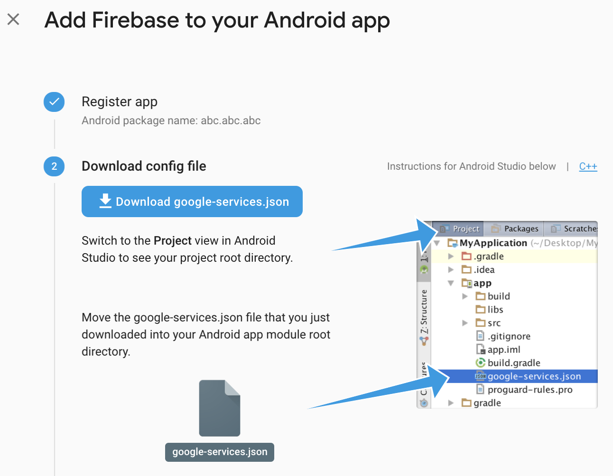

## Introduction

Firebase setup is required for the app to get some of the mobile features.
For the official document, refer to [react-native firebase initial setup](https://rnfirebase.io/docs/v5.x.x/installation/initial-setup)

1. Push Notification 
2. Analytics
3. Crashlytics
4. Database 
5. ...

## Create a project

1. Go to https://console.firebase.google.com
2. Login with ``root account``
3. Create a Project
4. Add Developer & Permission by clicking the gear on the left panel

### Create Project

### Add Developer & Permission

## Android Setup

1. Click on the gear on the left panel
2. Click on the Project Settings
3. Drag to below on the general tab.
4. Click on Add App
5. Click Android
6. **Input package name**
7. Download **google-services.json**
8. Place under **./android/google-services.json**

## iOS Setup

1. Click on the gear on the left panel
2. Click on the Project Settings
3. Drag to below on the general tab.
4. Click on Add App
5. Click iOS
6. **Input Bundle ID**
7. Download **GoogleService-Info.plist**
8. Place under **./ios/{nameoftheapp}/GoogleService-Info.plist**

## React Native Setup

`` TODO ``