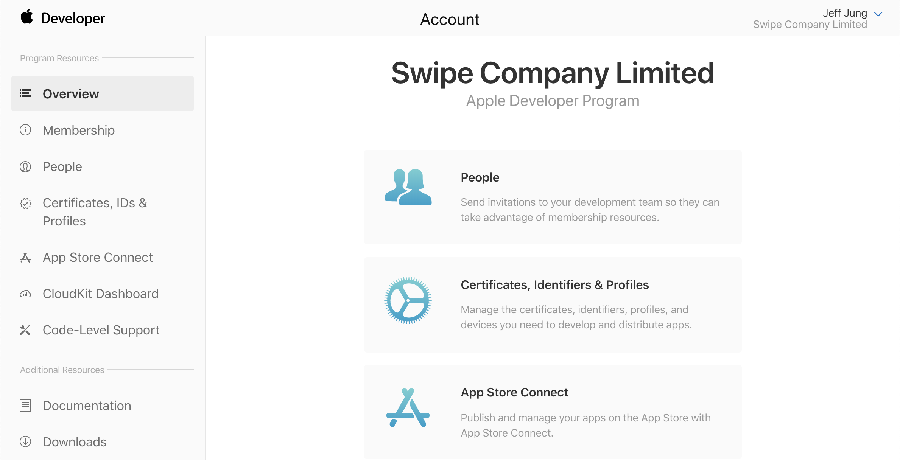
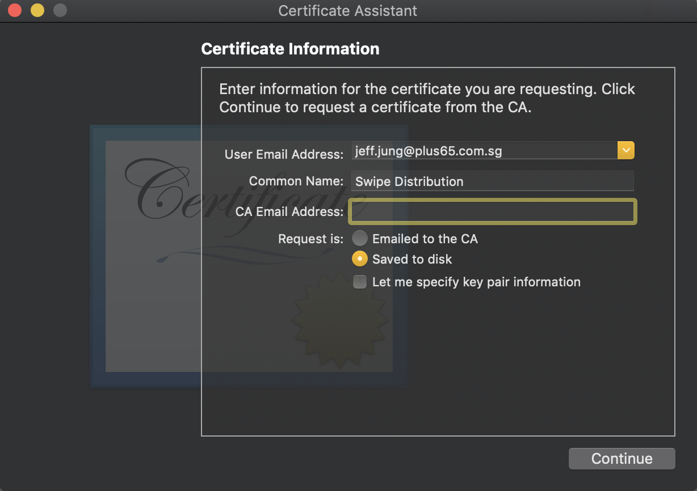
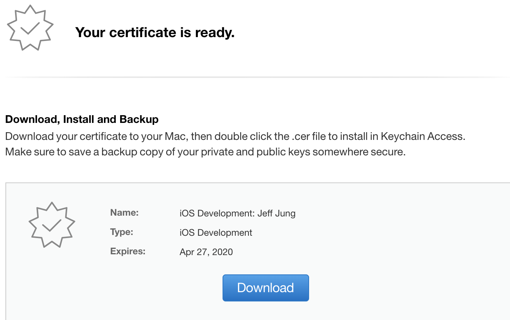
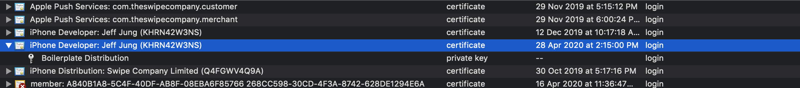
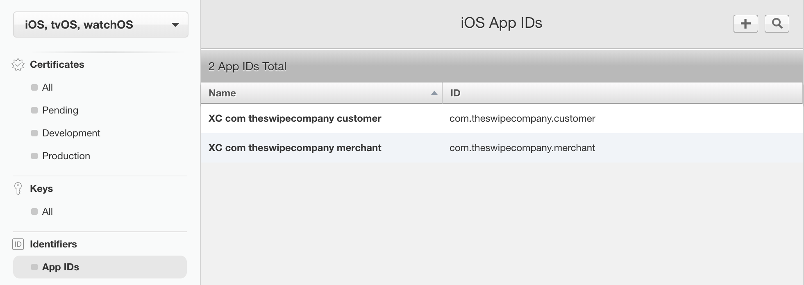
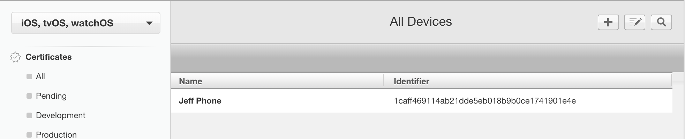
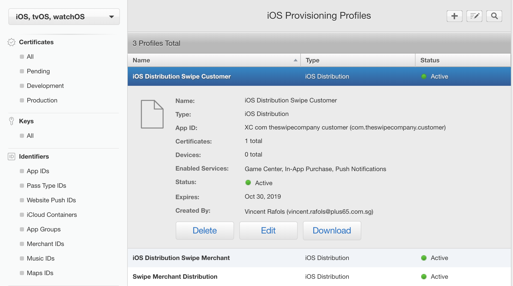

## Dashboard 

## Certificate

There are several uses of certificates. 

1. Build (development)
2. Build (distribution)
3. Push Notification
4. ...

## How to create certificate

In order to register the certificate to applde developer console, should make csr(certificate sigining request) file first.

1. hit ``open /Applications/Utilities/Keychain\ Access.app``
2. Menu - Keychain Access - Certificate Assistant - Request Certificate from a certificate authority
3. input email address 
4. input common name
5. check on **saved to disk**
6. request certificate from apple 
7. ``Downloaded file should be saved on somewhere, this will be shared with other developers``
---

### Creating a **.certSigningRequest** file from Keychain.app

---

### Request certificate from Apple

---

### Download & store the **.cer** file

Double click on the .cer file in order to save public & private key of the certificate on your Keychain.app. After this, you will be able to find the certificate under **My Certificate** tab. 

If you wish to share the file, you could export from Keychain.app, or you can share the initial **.cer** file with other developers. 

---

## Project Identifier

Any project should be registered under **Identifier** tab in order to deploy or build by using XCode. 

---

## Devices

Any physical devices, you wish to install the app manually, should be registered first on the Apple devices list first. 

Any other testing device can use the app from TestFlight App, which can be downloaded from AppStore, but the app should be deployed to iTunes connect first for the testers to download the app by usingTestFlight App.

---

## Provisioning Profiles

The provisioning profile is being used for the build. Provisioning profile includes the following; 

1. certificate either for production or development. 
2. devices list that allowed for manual installation
3. project bundle id
4. ...

---