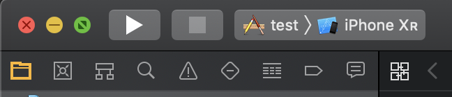

## Overall

* Debug & Release
* Install
* Archive
* Clean
* Upload (organizer)

## Debug & Release

A developer can change the debug & release flag from Product - Scheme

1. Click **Product - Scheme** from top menu
2. Edit Scheme 
3. Under **Info**, change the build configuration

## Install on the device or simulator

## Archive

1. Click **Product - Archive** from top menu

## Upload (organizer)

1. Open **Window-Organizer**
2. Click on build
3. Click on upload
