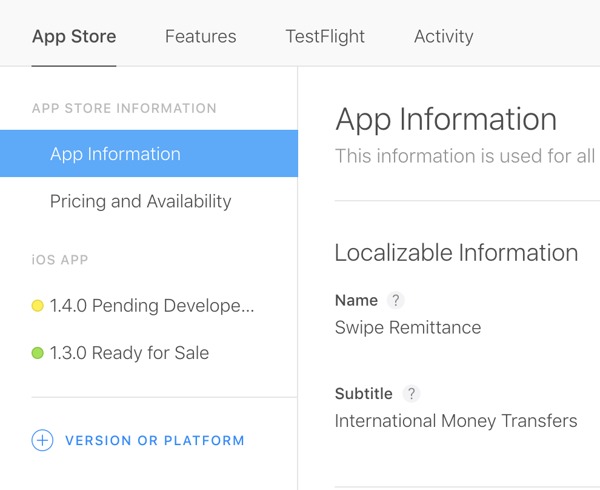
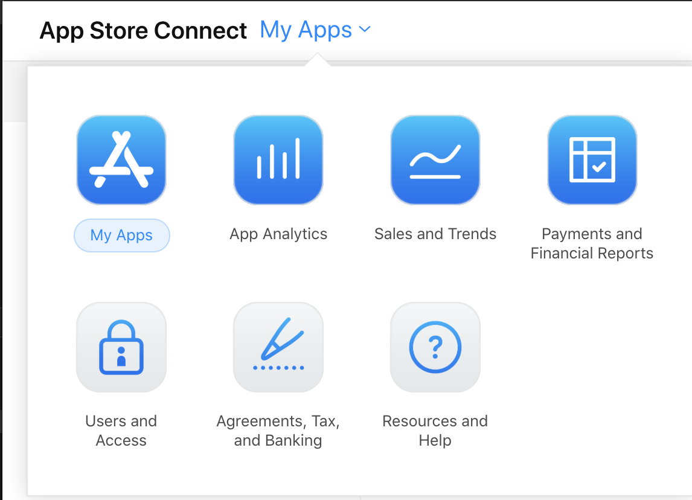
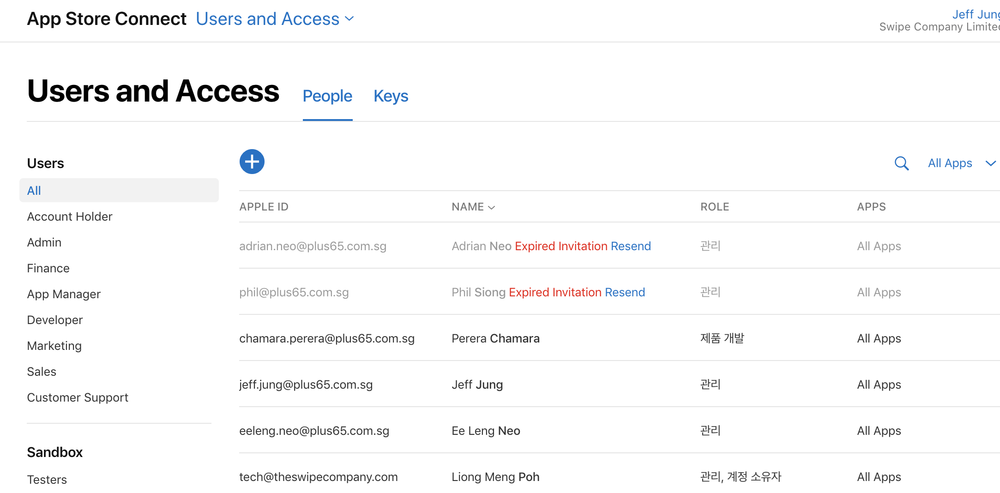
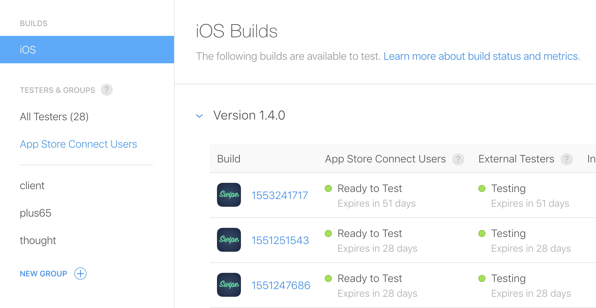
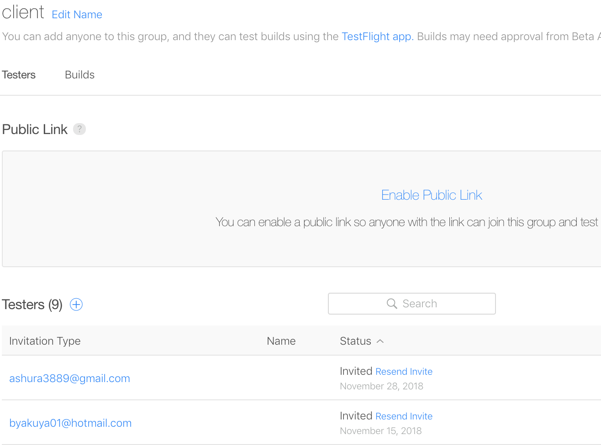
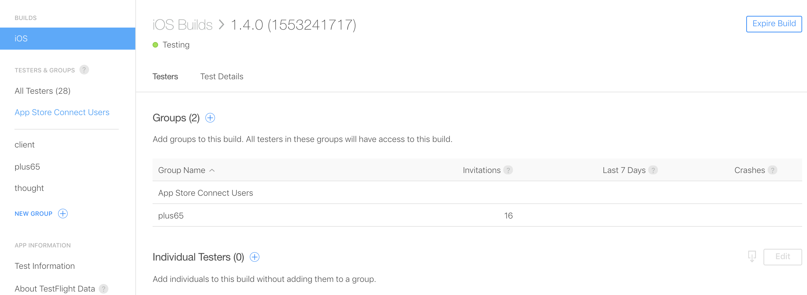

## My Apps

---

## User & Permissions

---

## Test Flight

The archives uploaded from **XCode** or **Fastlane**, should be available for testing. 
TestFlight is the platform that Apple provides for internal testing. 

---

### Testers Group

The developer can create the testers group and can assign a list of email to the testers group.

---

### Assign tester group to the build for testing

---

## New Version Release

1. Create version by clicking ``+ verison or platform``
2. Register the information by clicking the `version ex)1.2.0``
3. Submit for Review
4. Waiting for apple admin approval
5. Release to store

